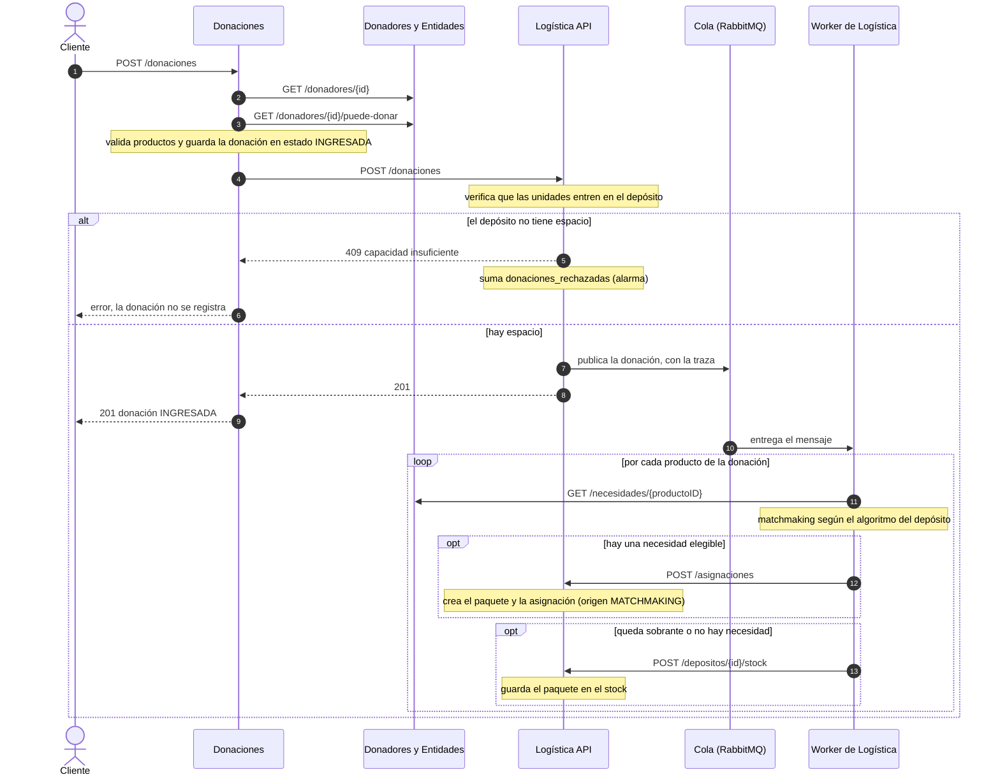
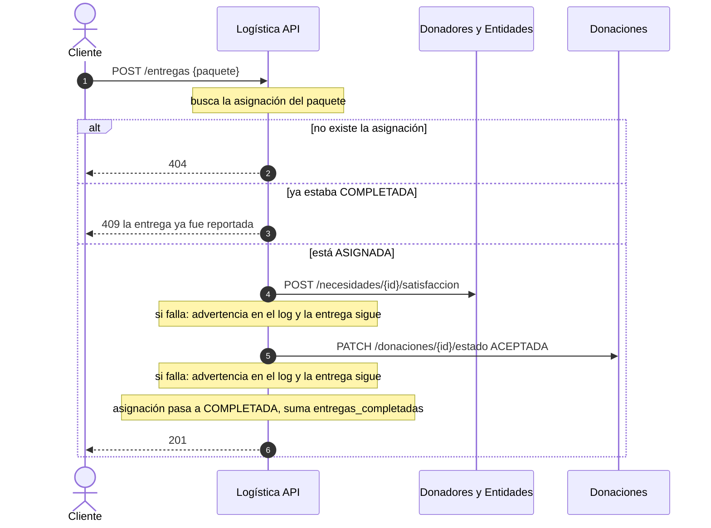
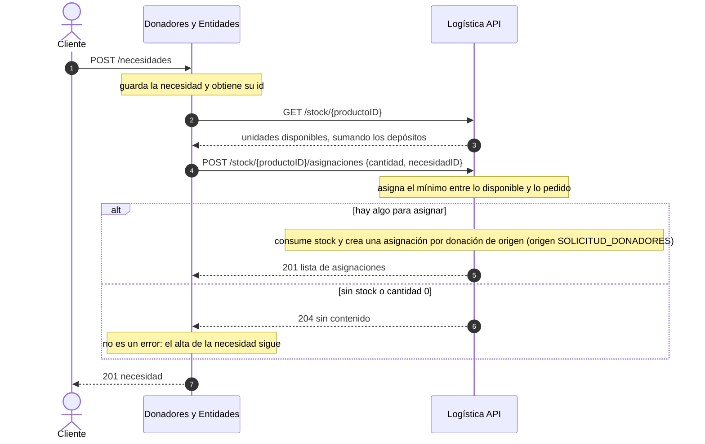

# Módulo Logística — API y diagramas de secuencia (Entrega 5)

Especificación de la API y diagramas de secuencia del módulo **Logística** (DonaTrack, TPA 2026).
La especificación interactiva está en `/swagger-ui.html` y el contrato en `/v3/api-docs`.

---

## Especificación de la API

Los errores se devuelven con un código según su causa: **400** si la solicitud es inválida,
**404** si el recurso no existe y **409** si la operación choca con el estado actual (por ejemplo,
capacidad insuficiente o una entrega ya reportada).

| Método | Ruta | Descripción | Errores |
|---|---|---|---|
| `POST` | `/depositos` | Crea un depósito. Nombre obligatorio, capacidad máxima no negativa. | 400 |
| `GET` | `/depositos` · `/depositos/{id}` | Lista los depósitos o trae uno, con su stock. | 400, 404 |
| `PUT` | `/depositos/{id}` | Modifica nombre, dirección y capacidad. No toca el stock ni el algoritmo. La capacidad no puede quedar por debajo de lo almacenado. | 400, 404, 409 |
| `DELETE` | `/depositos/{id}` | Elimina un depósito. Sólo si está vacío. | 404, 409 |
| `PATCH` | `/depositos/{id}/algoritmo` | Configura el algoritmo de matchmaking del depósito. Nace sin algoritmo. | 400, 404 |
| `POST` | `/donaciones` | Recibe una donación: verifica que entre en el depósito y la encola (o la procesa en el momento si la mensajería está apagada). | 400, 404, 409 |
| `POST` | `/asignaciones` | Alta de asignación por matchmaking que hace el Worker. Body: `{donacionID, productoID, cantidad, necesidadID}`. | 400 |
| `POST` | `/depositos/{id}/stock` | El Worker guarda el sobrante en el stock. Body: `{donacionID, productoID, cantidad}`. | 400, 404, 409 |
| `GET` | `/stock/{productoID}` | Stock disponible de un producto, sumando todos los depósitos. | |
| `POST` | `/stock/{productoID}/asignaciones` | Asigna desde stock a pedido de Donadores. Body: `{cantidad, necesidadID}`. Responde `201` con la lista de asignaciones o `204` si no hay nada para asignar. | 400 |
| `POST` | `/entregas` | Reporta la entrega de un paquete: satisface la necesidad, acepta la donación y completa la asignación. | 400, 404, 409 |
| `GET` | `/paquetes` | Lista los paquetes. | |
| `GET` | `/asignaciones` · `/asignaciones/{id}` · `/asignaciones/paquete/{paqueteID}` | Consulta de asignaciones, que incluyen su `origen`. | 404 |
| `DELETE` | `/testing/reset` | Limpia la base para reiniciar demostraciones. | |

Logística decide cuánto se asigna desde el stock: consume el mínimo entre lo disponible y lo
solicitado, y el solicitante sólo pide. Devuelve una asignación por cada donación de origen,
porque un paquete pertenece a una sola donación.

---

## Diagramas de secuencia

Los diagramas muestran las interacciones entre módulos, su orden y lo que hace cada uno. Cubren
las dos funcionalidades principales en las que Logística es protagonista, y una tercera que
Logística atiende a pedido de Donadores.

### 1 — Realizar una donación

Participa Donaciones, que orquesta, Donadores y Entidades, que valida al donador y aporta las
necesidades, y Logística con su Worker.

Logística no valida contra Donaciones que la donación exista. Donaciones llama dentro de su propia
transacción, antes de confirmarla: una consulta de vuelta no vería la fila, devolvería 404 y
terminaría en un rollback del otro lado.

Con la mensajería apagada, Logística hace en el momento lo que en el diagrama hace el Worker.

### 2 — Reportar la entrega de un paquete

Participan Logística, Donadores y Entidades, y Donaciones. Los dos avisos se hacen "de la mejor
manera posible": si uno falla, la entrega se completa igual, deja una advertencia en el log
centralizado y suma `notificaciones_fallidas`.

### 3 — Asignación desde stock, a pedido de Donadores

Es la parte de Logística de la funcionalidad "Registrar una nueva necesidad".

---

## Observabilidad

Cada pedido lleva un encabezado `X-Trace-Id`. Logística lo toma del pedido entrante (o genera
uno), lo agrega a todos los logs, lo reenvía en las llamadas a otros módulos y lo guarda dentro
del mensaje de la cola, de modo que el Worker retoma la misma traza. Los logs se envían a Better
Stack y las métricas a Datadog; ver `logging-y-trazas.md` y `metricas-y-alarmas.md`.
