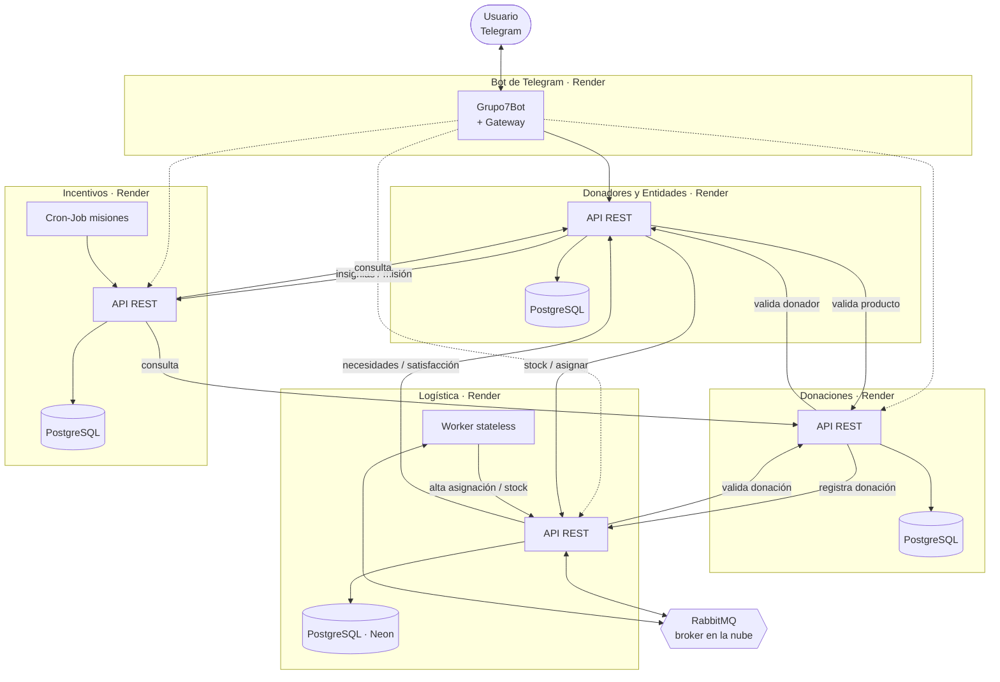

# Arquitectura integrada — DonaTrack (Entrega 4)

Diagrama de despliegue e integración de los 4 módulos + el bot

**Referencias:** flecha sólida = llamada REST síncrona (Feign/RestClient). Flecha punteada
= ruta de Gateway configurada en el bot pero sin comando que la use hoy.

> Armado leyendo los 4 repos del equipo, no es un diagrama entregado por otro compañero —
> conviene que lo revisen antes de darlo por definitivo en el informe.
