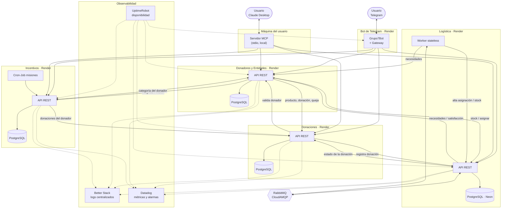

# Arquitectura integrada — DonaTrack (Entrega 5)

Diagrama de despliegue e integración de los 4 módulos, el bot, el servidor MCP y los servicios
de observabilidad.

```mermaid
flowchart TB
    Tel(["Usuario<br/>Telegram"])
    Claude(["Usuario<br/>Claude Desktop"])

    subgraph LOCAL["Máquina del usuario"]
        MCP["Servidor MCP<br/>(stdio, local)"]
    end

    subgraph BOT["Bot de Telegram · Render"]
        BotApp["Grupo7Bot<br/>+ Gateway"]
    end

    subgraph DON["Donaciones · Render"]
        DonAPI["API REST"]
        DonDB[("PostgreSQL")]
    end

    subgraph ENT["Donadores y Entidades · Render"]
        EntAPI["API REST"]
        EntDB[("PostgreSQL")]
    end

    subgraph LOGI["Logística · Render"]
        LogAPI["API REST"]
        Worker["Worker stateless"]
        LogDB[("PostgreSQL · Neon")]
    end

    subgraph INC["Incentivos · Render"]
        IncAPI["API REST"]
        Cron["Cron-Job misiones"]
        IncDB[("PostgreSQL")]
    end

    MQ{{"RabbitMQ<br/>CloudAMQP"}}

    subgraph OBS["Observabilidad"]
        BS["Better Stack<br/>logs centralizados"]
        DD["Datadog<br/>métricas y alarmas"]
        UR["UptimeRobot<br/>disponibilidad"]
    end

    Tel <--> BotApp
    Claude <--> MCP
    BotApp --> EntAPI
    BotApp --> DonAPI
    BotApp --> LogAPI
    BotApp --> IncAPI
    MCP --> DonAPI
    MCP --> EntAPI
    MCP --> LogAPI
    MCP --> IncAPI

    DonAPI --> DonDB
    EntAPI --> EntDB
    LogAPI --> LogDB
    IncAPI --> IncDB

    DonAPI -- "valida donador" --> EntAPI
    DonAPI -- "registra donación" --> LogAPI

    EntAPI -- "producto, donación, queja" --> DonAPI
    EntAPI -- "stock / asignar" --> LogAPI
    EntAPI -- "insignias / misión" --> IncAPI

    LogAPI -- "estado de la donación" --> DonAPI
    LogAPI -- "necesidades / satisfacción" --> EntAPI
    LogAPI <--> MQ
    Worker <--> MQ
    Worker -- "necesidades" --> EntAPI
    Worker -- "alta asignación / stock" --> LogAPI

    Cron --> IncAPI
    IncAPI -- "donaciones del donador" --> DonAPI
    IncAPI -- "categoría del donador" --> EntAPI

    DonAPI -.-> BS
    EntAPI -.-> BS
    LogAPI -.-> BS
    IncAPI -.-> BS
    DonAPI -.-> DD
    EntAPI -.-> DD
    LogAPI -.-> DD
    IncAPI -.-> DD
    UR -.-> DonAPI
    UR -.-> EntAPI
    UR -.-> LogAPI
    UR -.-> IncAPI
    UR -.-> BotApp
```

**Referencias:** flecha sólida = llamada REST síncrona (Feign o RestClient) o acceso a base de
datos. Flecha punteada = envío de logs y métricas, o chequeo de disponibilidad.

**Cambios respecto de la Entrega 4:**

- Logística ya no consulta a Donaciones para validar la donación: Donaciones la llama dentro de
  su propia transacción y la consulta de vuelta no vería la fila. Logística sólo le actualiza el
  estado de la donación al reportar la entrega.
- Los cuatro módulos envían sus logs a una única fuente de Better Stack, identificados por el
  nombre de cada aplicación, y todos los pedidos llevan el encabezado `X-Trace-Id` para seguir una
  operación entre módulos.
- Los módulos publican sus métricas a Datadog, con la etiqueta `modulo`, y las alarmas se
  configuran allí.
- El servidor MCP corre en la máquina del usuario y se conecta con Claude Desktop por entrada y
  salida estándar.
