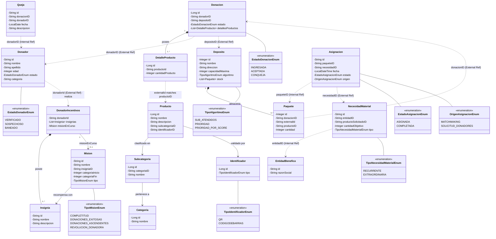

# Diagrama de dominio — DonaTrack (Entrega 4)

Modelo de clases de los 4 módulos.

```mermaid
classDiagram
    %% ===================== Donadores y Entidades =====================
    class Donador {
        -String id
        -String nombre
        -String apellido
        -Integer edad
        -EstadoDonadorEnum estado
        -String categoria
    }
    class EntidadBenefica {
        -String id
        -String razonSocial
    }
    class NecesidadMaterial {
        -String id
        -String entidadID
        -String productoSolicitadoID
        -Integer cantidadObjetivo
        -TipoNecesidadMaterialEnum tipo
    }
    class Queja {
        -String id
        -String donacionID
        -String donadorID
        -LocalDate fecha
        -String descripcion
    }
    class EstadoDonadorEnum {
        <<enumeration>>
        VERIFICADO
        SOSPECHOSO
        BANEADO
    }
    class TipoNecesidadMaterialEnum {
        <<enumeration>>
        RECURRENTE
        EXTRAORDINARIA
    }
    NecesidadMaterial ..> EntidadBenefica : entidadID (Internal Ref)
    Queja ..> Donador : donadorID (Internal Ref)
    Donador -- EstadoDonadorEnum
    NecesidadMaterial -- TipoNecesidadMaterialEnum

    %% ===================== Incentivos =====================
    class DonadorIncentivos {
        -String donadorId
        -List~Insignia~ insignias
        -Mision misionEnCurso
    }
    class Mision {
        -String id
        -String nombre
        -String insigniaID
        -Integer categoriaInicio
        -Integer categoriaFin
        -TipoMisionEnum tipo
    }
    class Insignia {
        -String id
        -String nombre
        -String descripcion
    }
    class TipoMisionEnum {
        <<enumeration>>
        COMPLETITUD
        DONACIONES_EXITOSAS
        DONACIONES_ASCENDENTES
        REVOLUCION_DONADORA
    }
    DonadorIncentivos "1" *-- "0..*" Insignia : posee
    DonadorIncentivos "1" --> "0..1" Mision : misionEnCurso
    Mision --> Insignia : recompensa con
    Mision -- TipoMisionEnum
    Donador ..> DonadorIncentivos : donadorId (External Ref) · realiza

    %% ===================== Donaciones =====================
    class Donacion {
        -Long id
        -String donadorID
        -String depositoID
        -EstadoDonacionEnum estado
        -List~DetalleProducto~ detallesProductos
    }
    class DetalleProducto {
        -Long id
        -String productoId
        -Integer cantidadProducto
    }
    class Producto {
        -Long id
        -String nombre
        -String descripcion
        -String subcategoriaID
        -String identificadorID
    }
    class Categoria {
        -Long id
        -String nombre
    }
    class Subcategoria {
        -Long id
        -String categoriaID
        -String nombre
    }
    class Identificador {
        -Long id
        -TipoIdentificadorEnum tipo
    }
    class EstadoDonacionEnum {
        <<enumeration>>
        INGRESADA
        ACEPTADA
        CONQUEJA
    }
    class TipoIdentificadorEnum {
        <<enumeration>>
        QR
        CODIGODEBARRAS
    }
    Donacion "1" *-- "1..*" DetalleProducto : posee
    Donacion ..> Donador : donadorID (External Ref)
    Donacion ..> Deposito : depositoID (External Ref)
    DetalleProducto ..> Producto : externalId matches productoID
    Producto --> Subcategoria : clasificado en
    Producto --> Identificador : validado por
    Subcategoria --> Categoria : pertenece a
    Donacion -- EstadoDonacionEnum
    Identificador -- TipoIdentificadorEnum

    %% ===================== Logística =====================
    class Deposito {
        -Integer id
        -String nombre
        -String direccion
        -Integer capacidadMaxima
        -TipoAlgoritmoEnum algoritmo
        -List~Paquete~ stock
    }
    class Paquete {
        -Integer id
        -String donacionID
        -String externalId
        -String productoID
        -Integer cantidad
    }
    class Asignacion {
        -String id
        -String paqueteID
        -String necesidadID
        -LocalDateTime fecha
        -EstadoAsignacionEnum estado
        -OrigenAsignacionEnum origen
    }
    class EstadoAsignacionEnum {
        <<enumeration>>
        ASIGNADA
        COMPLETADA
    }
    class OrigenAsignacionEnum {
        <<enumeration>>
        MATCHMAKING
        SOLICITUD_DONADORES
    }
    class TipoAlgoritmoEnum {
        <<enumeration>>
        SUB_ATENDIDOS
        PRIORIDAD
        PRIORIDAD_POR_SCORE
    }
    Deposito "1" *-- "0..*" Paquete : almacena
    Paquete ..> Donacion : donacionID (External Ref)
    Asignacion ..> Paquete : paqueteID (Internal Ref)
    Asignacion ..> NecesidadMaterial : necesidadID (External Ref)
    Deposito -- TipoAlgoritmoEnum
    Asignacion -- EstadoAsignacionEnum
    Asignacion -- OrigenAsignacionEnum
```

