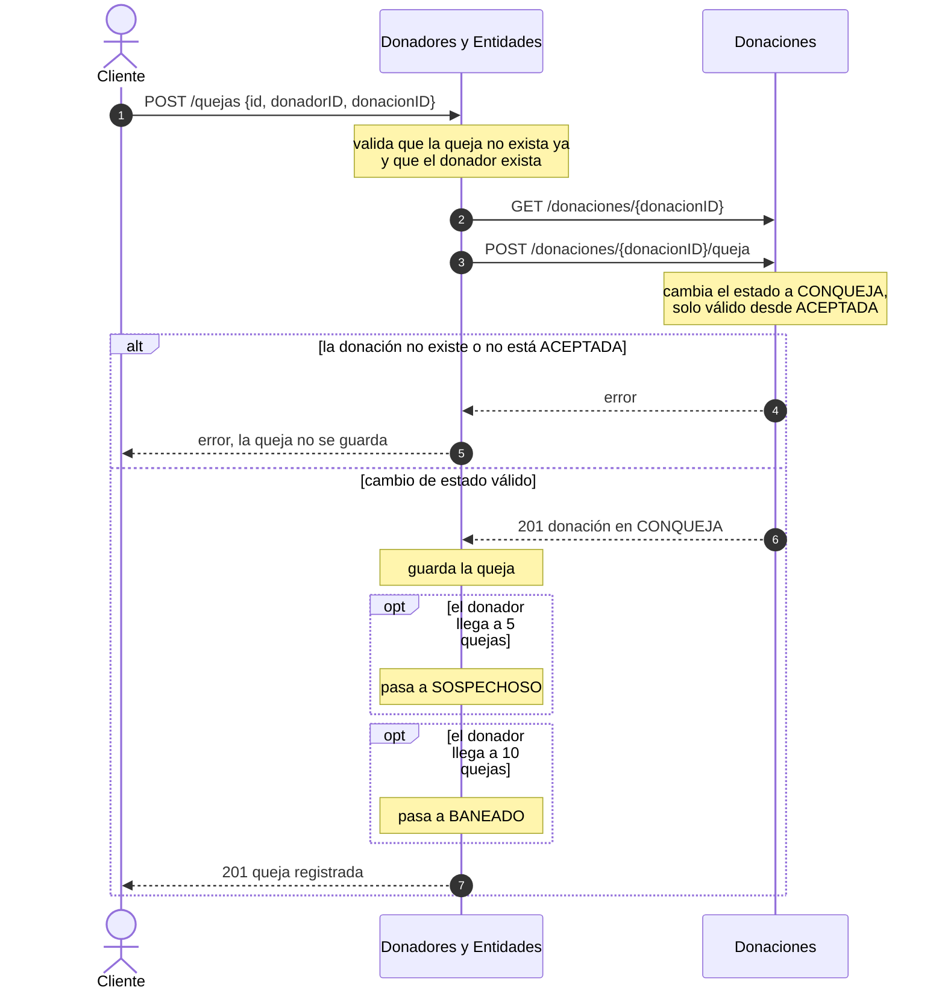
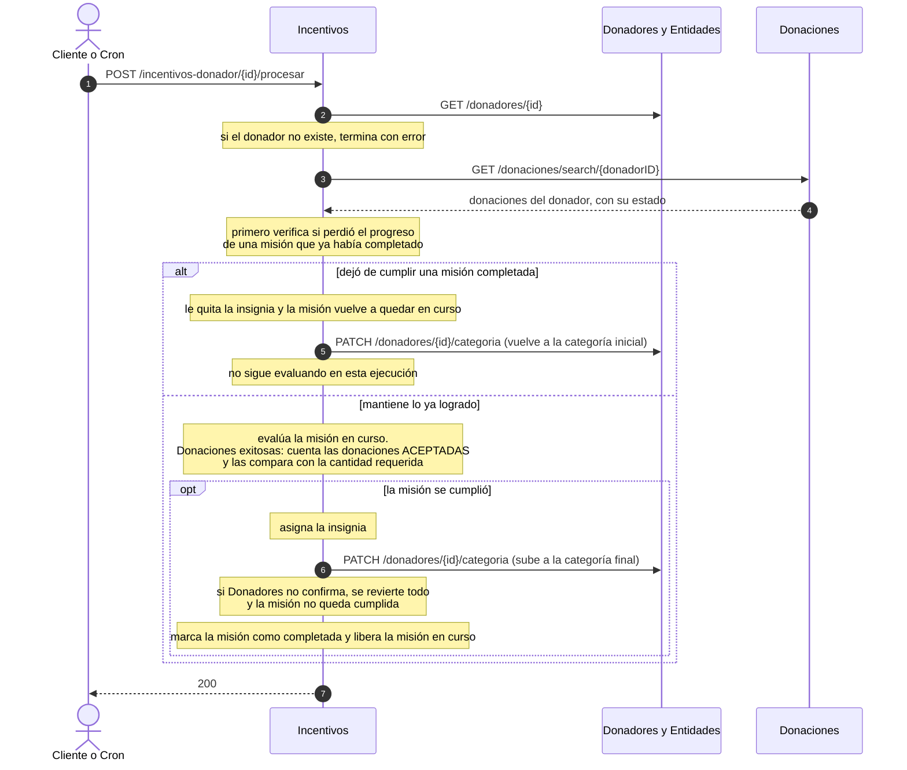
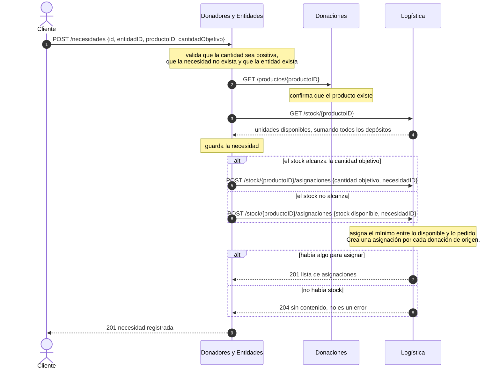
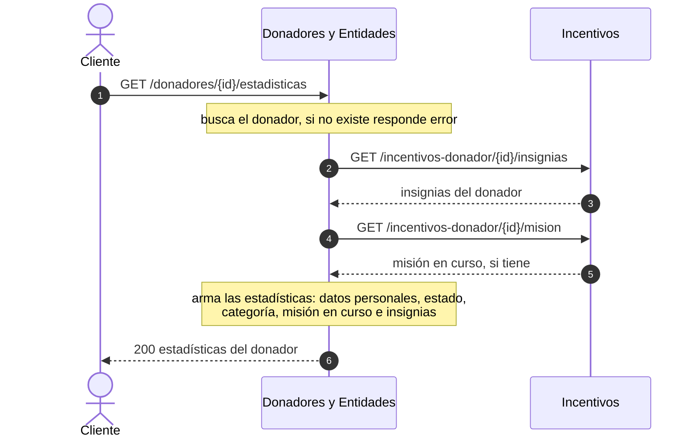

# Diagramas de secuencia de las funcionalidades integradas (Entrega 5)

La Entrega 5 pide un diagrama de secuencia por cada una de las seis funcionalidades principales, a nivel de
servicios o componentes: la interacción entre los módulos, el orden en que ocurren y lo que hace cada uno.

| # | Funcionalidad | Dónde está |
|---|---|---|
| 1 | Realizar una donación | `api-y-secuencias-logistica.md`, diagrama 1 |
| 2 | Reportar la entrega de un paquete | `api-y-secuencias-logistica.md`, diagrama 2 |
| 3 | Registrar una queja sobre una donación ya entregada | Este documento |
| 4 | Procesar un donador (incentivos) | Este documento |
| 5 | Registrar una nueva necesidad | Este documento, flujo completo. El lado de Logística, en detalle, está en `api-y-secuencias-logistica.md`, diagrama 3 |
| 6 | Obtener las estadísticas de un donador | Este documento |

Las rutas y las reglas de cada diagrama salen del código de cada módulo. Las llamadas entre módulos son REST síncronas.

---

## 3 — Registrar una queja sobre una donación ya entregada

Donadores es quien recibe la queja y orquesta. La donación tiene que estar en estado ACEPTADA, que es el estado al que
la lleva Logística cuando se reporta su entrega (diagrama 2). Si no lo está, Donaciones rechaza el cambio y la queja
no se guarda.

Un donador BANEADO ya no puede donar: Donaciones consulta `puede-donar` antes de registrar cada donación (diagrama 1).

---

## 4 — Procesar un donador (incentivos)

Incentivos evalúa la misión en curso del donador contra sus donaciones y, si la cumplió, le da la insignia y sube su
categoría en Donadores. Se dispara de dos formas, con el mismo trabajo: a pedido con `POST /incentivos-donador/{id}/procesar`,
o por un cron que corre cada un minuto (configurable) sobre los donadores que tienen una misión en curso o ya completadas.

Las donaciones llegan a ACEPTADA cuando Logística reporta la entrega del paquete (diagrama 2). Por eso el avance de las
misiones depende de ese flujo. La cantidad requerida de donaciones exitosas es configurable por misión.

---

## 5 — Registrar una nueva necesidad

Donadores registra la necesidad de una entidad y, de inmediato, intenta cubrirla con el stock que Logística tiene guardado.

Las asignaciones quedan con origen SOLICITUD_DONADORES, para distinguirlas de las que decide el matchmaking cuando
llega una donación (diagrama 1). La entrega de esos paquetes se reporta con el diagrama 2.

---

## 6 — Obtener las estadísticas de un donador

Donadores arma las estadísticas con sus propios datos y las completa con lo que sabe Incentivos.

