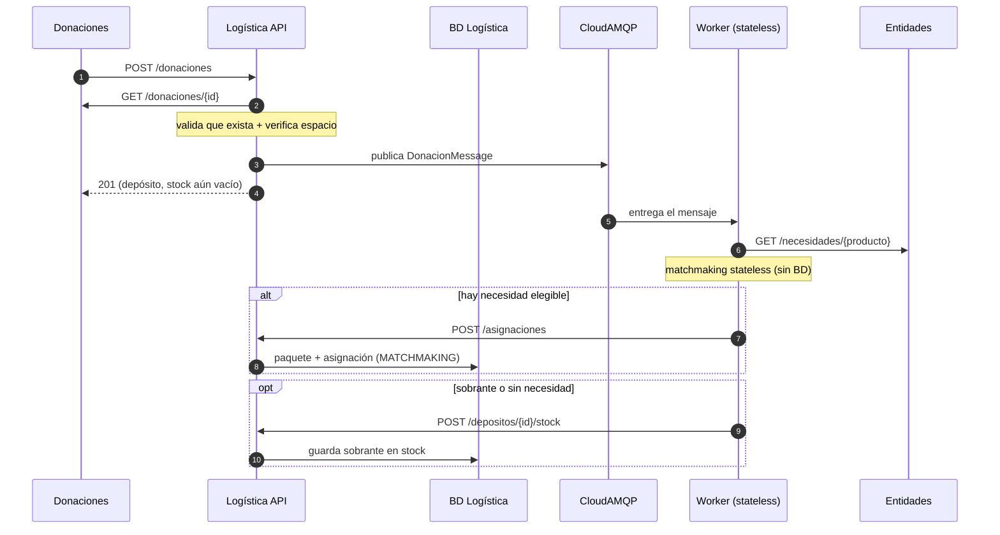
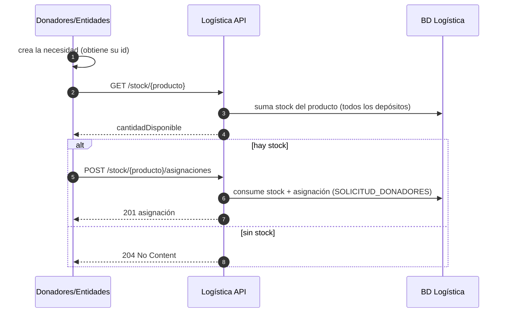
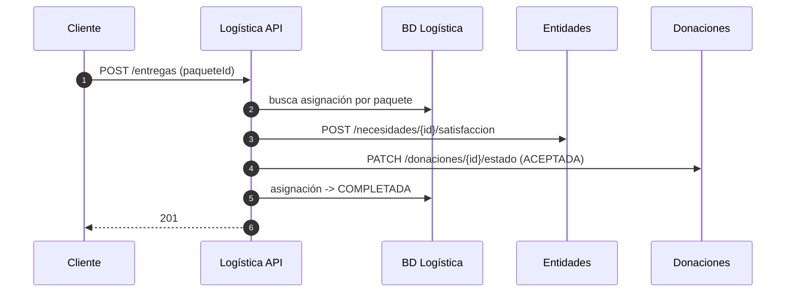

# Módulo Logística — Entrega 4

Especificación de la API y diagramas de secuencia del módulo **Logística** (DonaTrack, TPA 2026).

---

## Especificación de la API

Los marcados **(nuevo)** se incorporaron en la Entrega 4.

| Método | Ruta | Descripción |
|---|---|---|
| `POST` | `/donaciones` | Recibe una donación: valida en Donaciones, verifica espacio y **encola** (o procesa sync si la mensajería está apagada). |
| `POST` | `/asignaciones` **(nuevo)** | Alta de asignación por matchmaking que hace el **Worker**. Body: `{donacionID, productoID, cantidad, necesidadID}`. |
| `POST` | `/depositos/{id}/stock` **(nuevo)** | El Worker guarda el sobrante en el stock. Body: `{donacionID, productoID, cantidad}`. |
| `GET` | `/stock/{productoID}` **(nuevo)** | Stock disponible de un producto, agregado de todos los depósitos. → `{productoID, cantidadDisponible}`. |
| `POST` | `/stock/{productoID}/asignaciones` **(nuevo)** | Asigna desde stock a pedido de Donadores. Body: `{cantidad, necesidadID}` → `201` asignación, o `204` si no hay stock. |
| `POST` | `/entregas` | Reporta una entrega: satisface la necesidad, actualiza la donación y marca la asignación `COMPLETADA`. |
| `GET` | `/asignaciones` | Lista todas las asignaciones (incluye el campo `origen`). |
| `GET` | `/asignaciones/{id}` **(nuevo)** | Asignación por su id real. |
| `GET` | `/asignaciones/paquete/{paqueteID}` **(nuevo)** | Asignación por paquete (antes ocupaba la ruta `/{id}`). |
| `POST` | `/depositos` | Crea un depósito con su capacidad máxima. |
| `GET` | `/depositos` · `/depositos/{id}` | Lista los depósitos o trae uno (incluye `stockActual`). |
| `PATCH` | `/depositos/{id}/algoritmo` | Configura el algoritmo de matchmaking del depósito. |
| `DELETE` | `/testing/reset` | Limpia la base (asignaciones, paquetes, depósitos) para reiniciar demos. |

---

## Diagramas de secuencia

### Flujo 1 — Recepción de donación (asincrónica) · Parte B

### Flujo 2 — Asignación desde stock por Donadores · Parte C

### Flujo 3 — Reportar entrega

